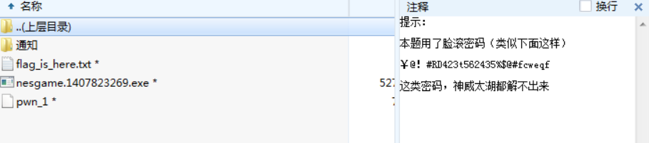
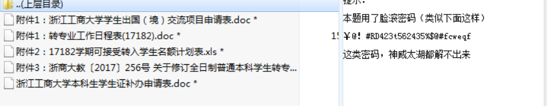
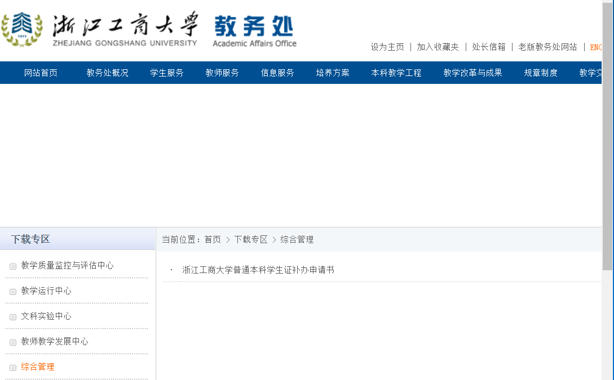
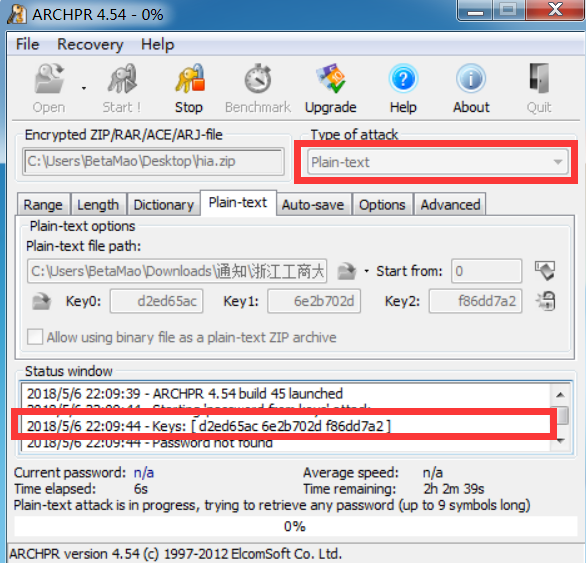
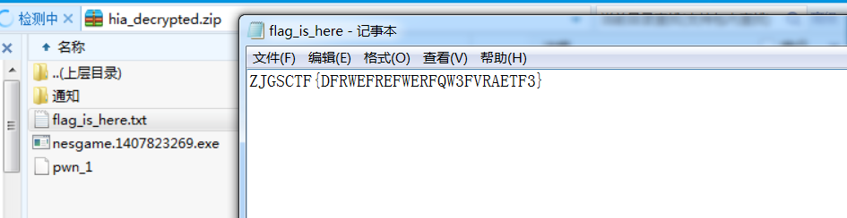

## 解压
```py
#coding=utf-8
#author:宁宁

```

## 解密
最后一层是被加密的压缩包，从注释看出不能从暴力或字典跑出密码：
 
仔细观察发现有些无用的通知文件：
 
而这些文件可以从教务网获得：
 
用已知明文攻击，即可解密数据包（注意，此时生成的压缩包与被加密的压缩包要使用相同的程序压缩，不过压缩程序就那么几种，多试试就好了）
 
停止后保存明文即可：
 
