天网恢恢疏而不漏~（逃 ，做任何事情都会留下痕迹，可能这里面的任何一条痕迹都会致自己于死地，所以刑法285，286了解一下？本题有多条线索，任意之一就可能做出此题。
## 挂载磁盘
题目给了两个文件，按题意一个是磁盘镜像，一个是内存镜像，磁盘镜像已经被加密过了，需要从内存里面找到关键数据。
经百度BitLocker是Windows7以上系统自带的一款加密软件，而BitLcoker.vmdk的后缀百度得知是VMware虚拟机的虚拟磁盘文件，于是选择一台Windows7虚拟机挂载它:

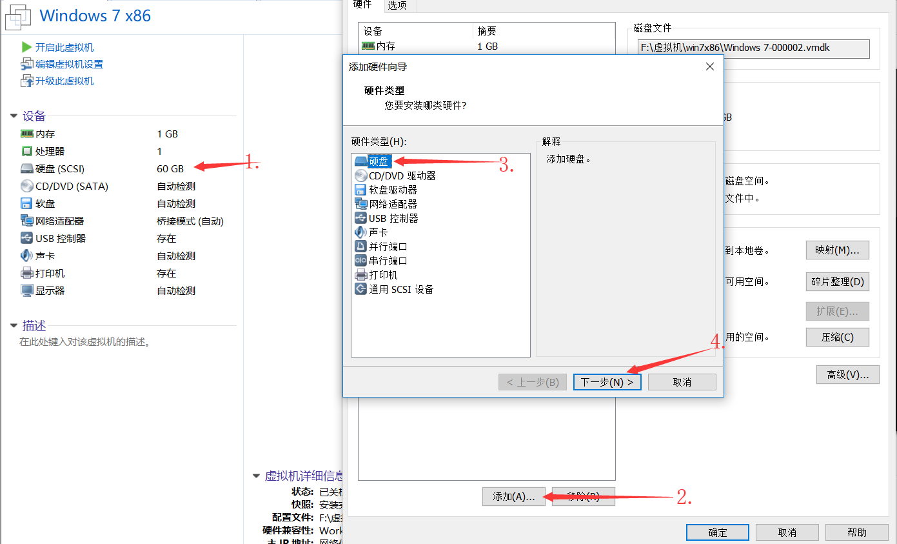

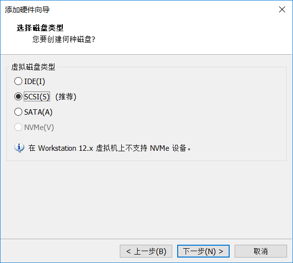

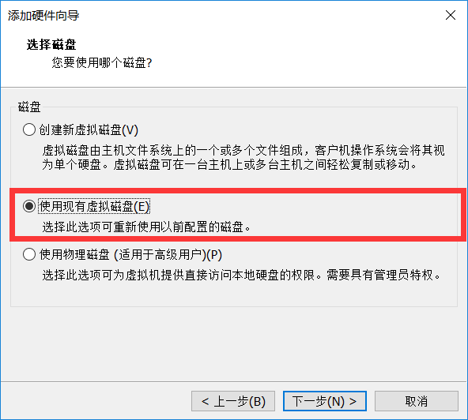

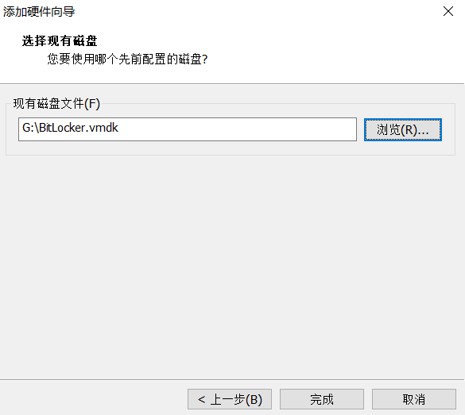 

启动系统后就可以看见新增了一个带有锁标记的磁盘，但是没有密码不能打开：

 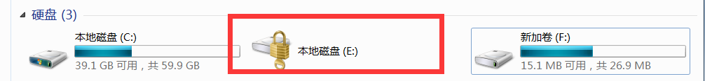

## 分析内存
经过百度，发现有一款内存取证分析神器：volatity（用法网上很多）
先检查内存镜像版本：

 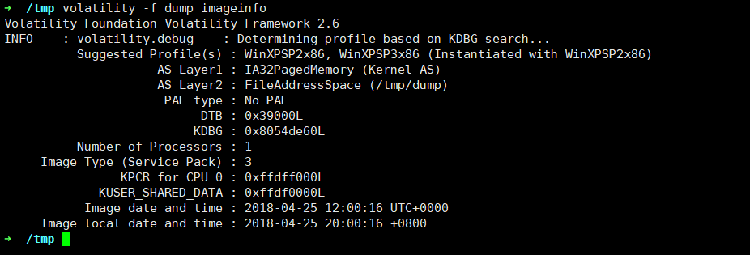

经测试（随意啦）是WinXPSP3x86，接下来先找找有没有账号密码可以去撞（毕竟很多人都会使用同一个密码）：

 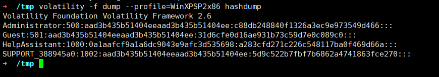

查到Windows账户的hash值了，通过一些工具或者网站能够得到明文（例如下）：

 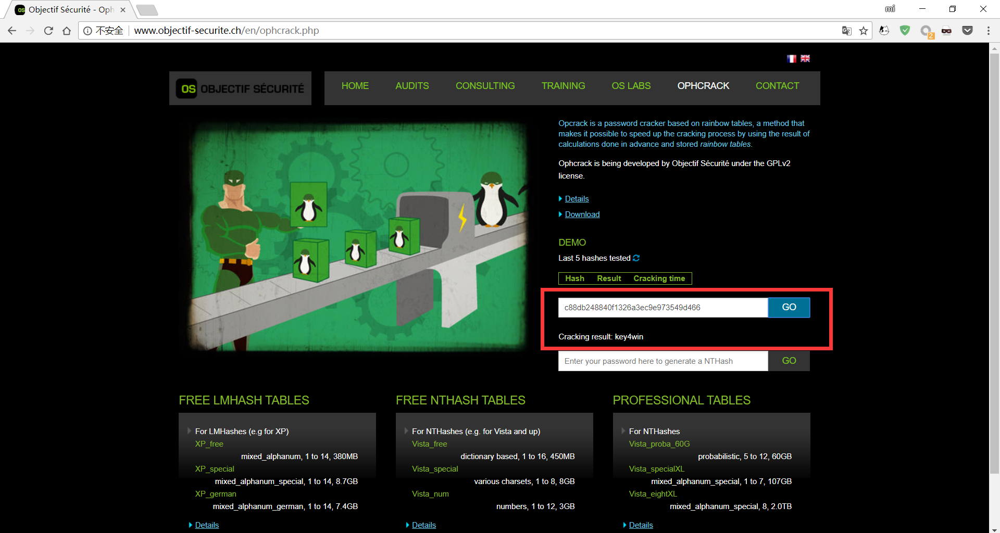

当然也可以直接拿内存里面保存的密码：

 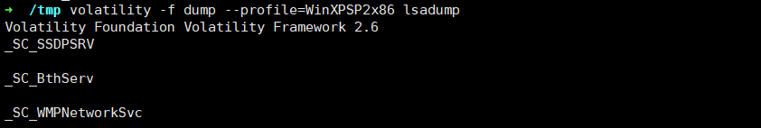

 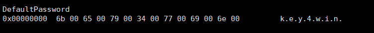 

是不是很开心的拿去测试，结果发现这个密码解不开（假装你没有解开，就继续向下看吧），接着分析分析当时运行了哪些程序，发现了几个可疑的家伙：

 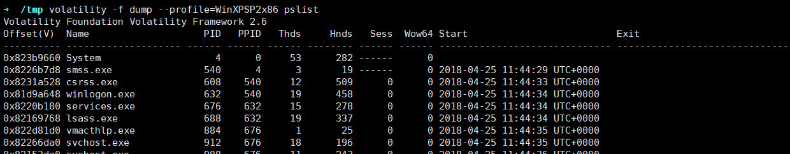

 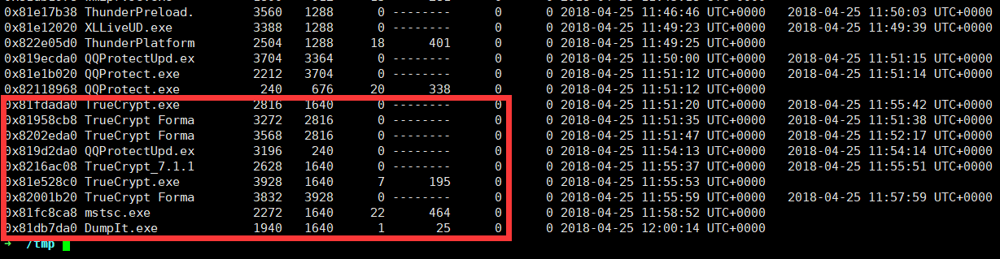

（truecrypt是，本来题都出好了，但是后来想到可能太难了，就又重新多加了这么一个东西，若最后没人做出那一步，就上这个东东，所以一开始没有提供它的容器，这里先不管）经检查mstsc是一个远程桌面，很可疑呀，远程桌面只是一个图像窗口，那么就使用图像编辑工具看看它里面有什么，不过需要先把进程的内存dump出来，不然太大了~：

 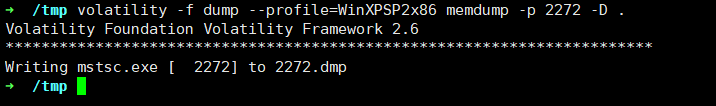

好吧，这种解法挺难的，那么，出hint啦，一个文件，你猜是啥，我猜是truecrypt容器文件，因为在上面已经发现了truecrypt的进程，而且要是做过更多测试会发现此时桌面的如下图：

 

 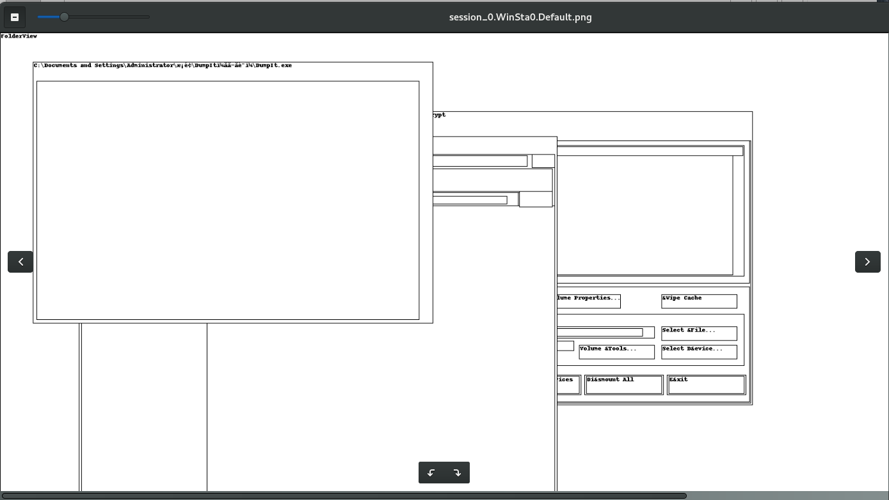

种种迹象表明他很关键，于是检查一下，果然在内存中找到了它的密钥：

 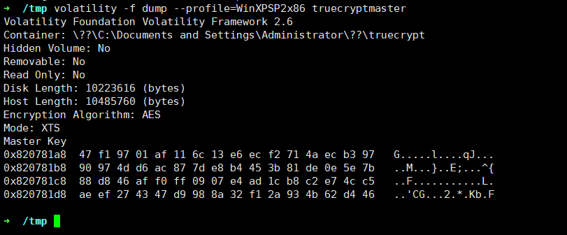

然后使用elecomsoft解密容器：

 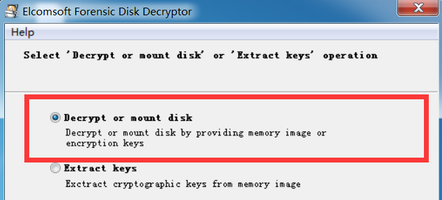

 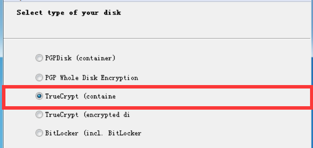

 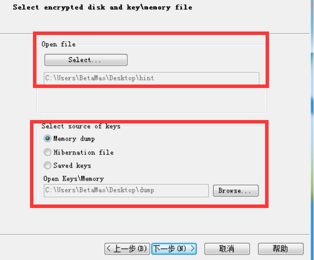

 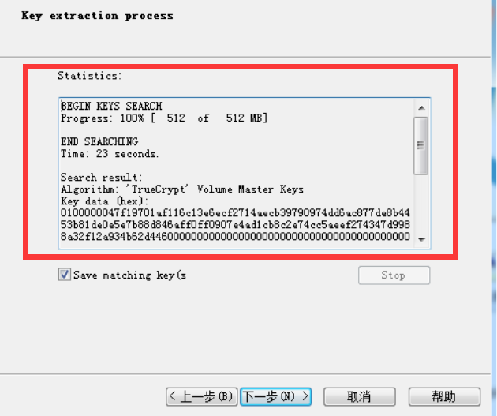

 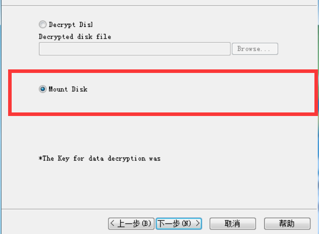

 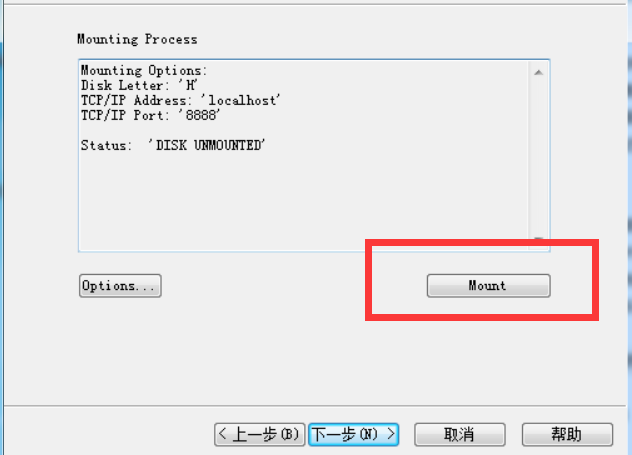 

在我的电脑里多了一个H盘，里面有一个密码文件，可以看到几个密码，但是测试都不对

 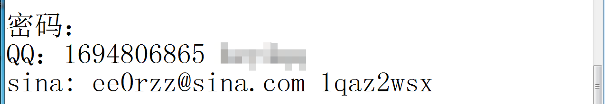

到了这一步，聪明的你一定看出来了，葛某虽然很有安全意识，每个账号用不同的密码，但是密码规律性太强，于是可以猜测对BitLocker的密码为**key4bitlocker**，果然打开文件啦，另外还有线索，打开数据包后，分析发现很多访问acm.zjgsu.edu.cn的链接，仔细观察发现有注册用户与登陆相关的url，或者直接在正文搜索password即可得到一个密码：

 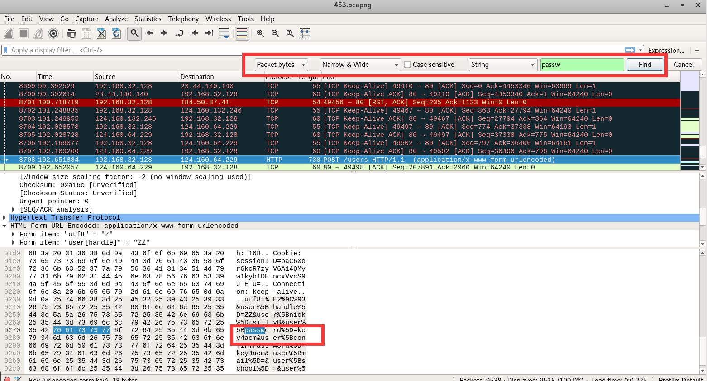

## 恢复文件
打开后，翻遍了其他文件都没有flag，然后有两个可以的数据包，千万别被迷惑了，因为当时铁盆让我出一道数据包的题我就抓了两个，后来觉得没什么思路就换程这道题啦，数据包只是随手扔进去的，入坑别怪我，不过新建文件夹这么司机的名字就不好奇里面什么东西都没有？

 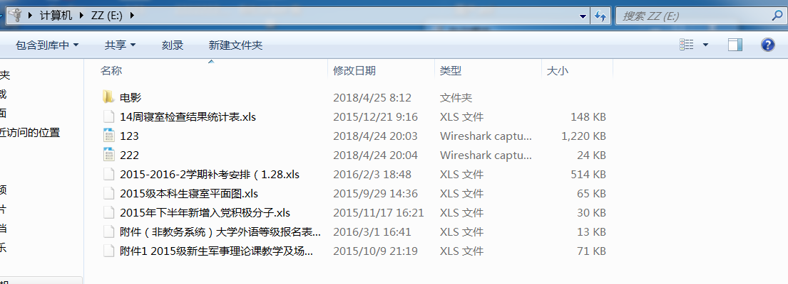

哈哈哈，果断需要数据恢复，使用任意一款数据恢复工具，扫描得到下面这个被删除的文件：

 

恢复，得到flag：

 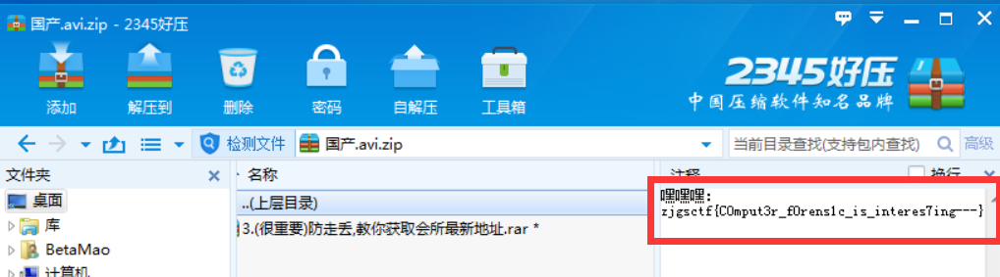
