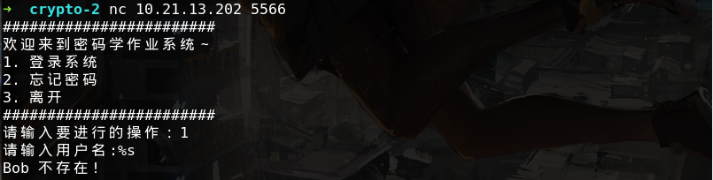
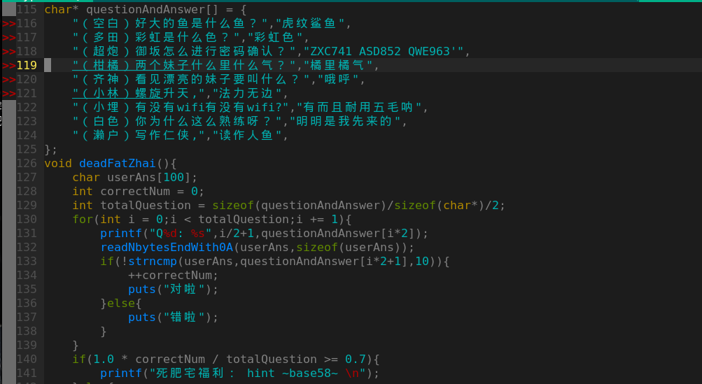
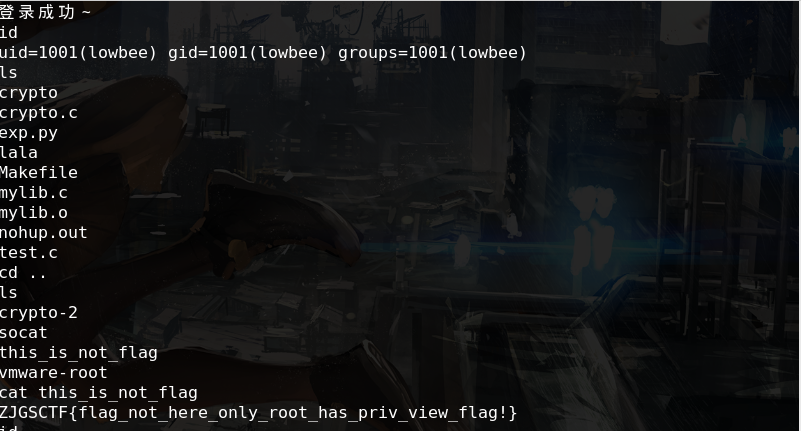
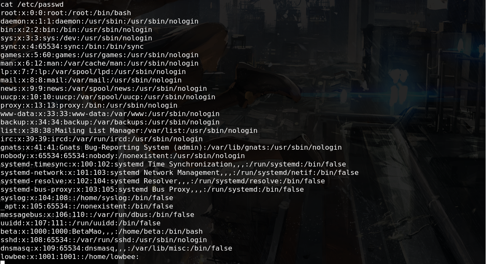
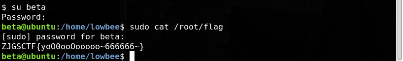
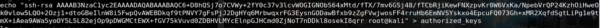
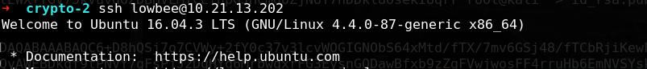
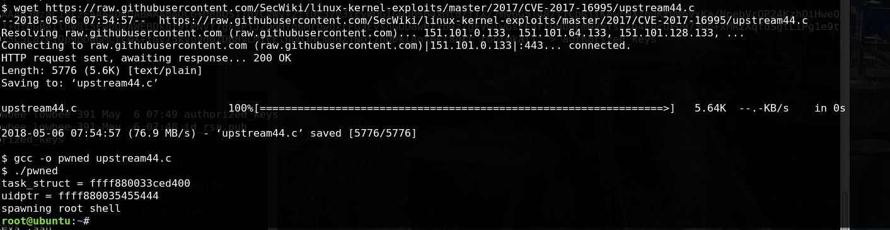

1. 密码学系统，猜测账号是alice或者bob，也可以根据返回输入，猜测格式化串漏洞得到用户名：

 

密码不知道但是账号这么白痴密码可以试试弱密码嘛，最常见的123456即可，或者没有验证码之类的限制可以跑字典呢，实在不知道可以使用忘记密码
2. 忘记密码是做算术题，很基本的编程：
```py
#!/usr/bin/env python
# coding=utf-8

from pwn import *
#context.log_level = "debug"
p = process("./crypto")
p.sendlineafter("请输入要进行的操作：","2")
p.recvuntil("第一步，请做100次基本的数学运算吧：")
for i in range(100):
    p.recvuntil(' : ')
    e = p.recvuntil(" = ")[:-3]
    r = eval(e)
    if '/' in e and r<0:
        r+=1
    log.info("%d : %s = %d"%(i,e,r))
    p.sendline(str(r))
log.success(p.recvuntil("#"))
#p.interactive()
```
得到的东西是base58编码的，根据题中区块链这个线索可以得到，要是不知道，多试几次会触发死肥宅支线，答题就可以得到此提示，若不会可以百度：



3.	解密后得到账号密码，登陆系统发现是低权限用户，而flag在root目录下：

 

4.	提权，观察passwd文件发现还有个beta，装过ubuntu的都知道1000是安装时创建的管理员用户，虽然不是root权限但是有sudo权限，于是尝试用弱密码登陆该账户成功：

 

 

5.	另外，检查内核版本，通过百度发现存在CVE-2017-16995内核提权漏洞：

 

下载编译后不能成功提权，猜测环境问题，由于此时已经有lowbee用户的权限了，而且还开了ssh，于是可以创建公钥免密登陆：

 

 

接着执行得到root权限

 

