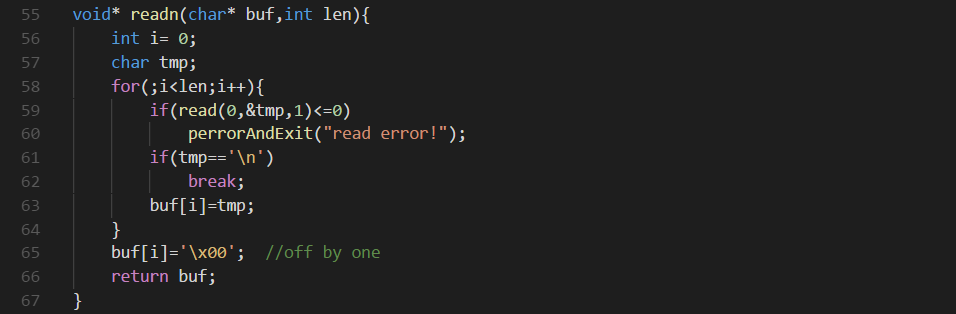
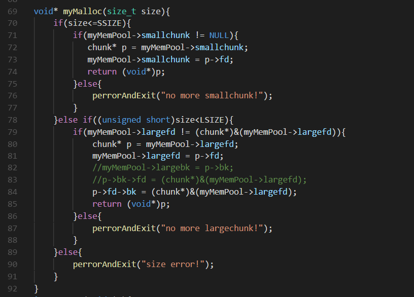

自己写的简单的堆分配，没有任何检查，以下存在off by one漏洞溢出一字节：
 
一个简单的用法就是溢出还在bins中的小chunk指针，覆盖到一个已分配的chunk，通过写里面的数据使其指向任意想要控制的位置，例如GOT表，再次分配将能进行任意读写操作。另一漏洞时分配内存时存在整数强制类型转换导致的溢出，当输入的大小为0x10000+SSIZE+1时，将会分配一个LSIZE大的内存，于是可以溢出大量的字节，由于没有数据执行保护，可以直接在堆上写shellcode并改变程序流：

